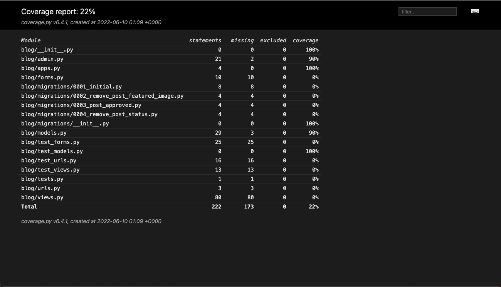
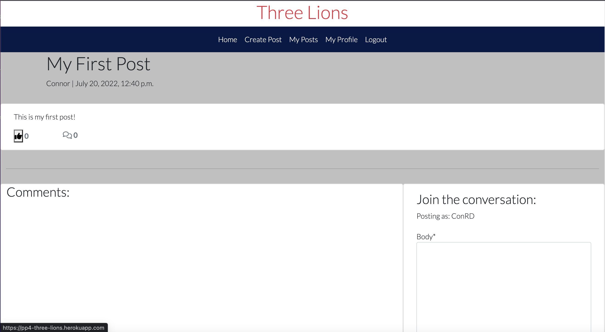
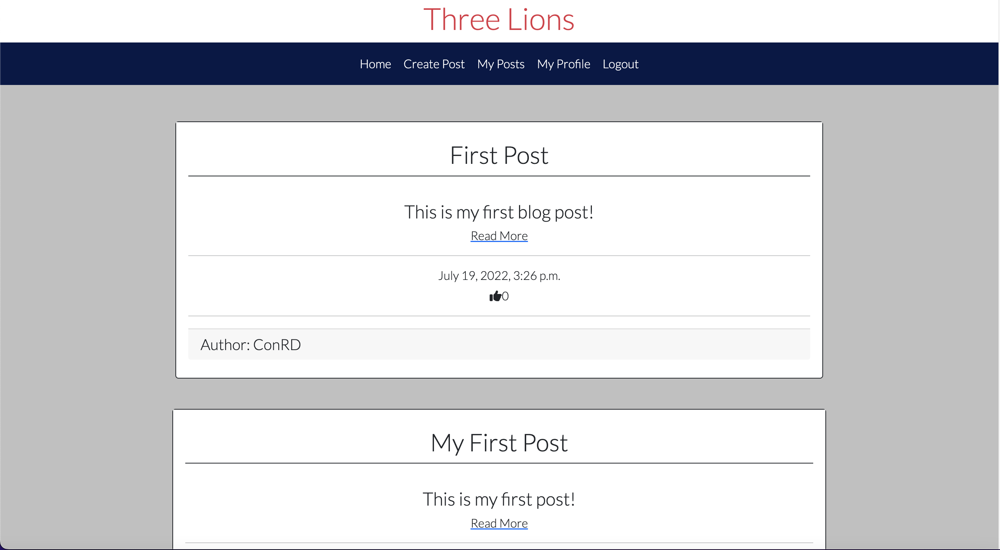
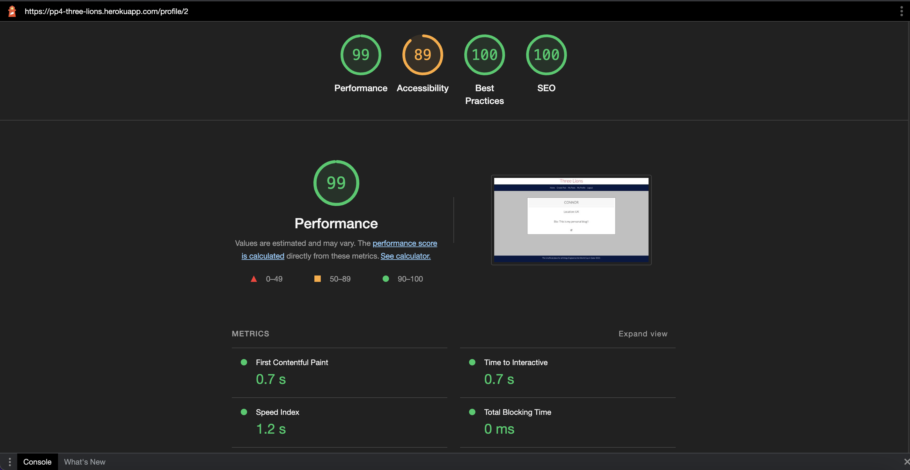
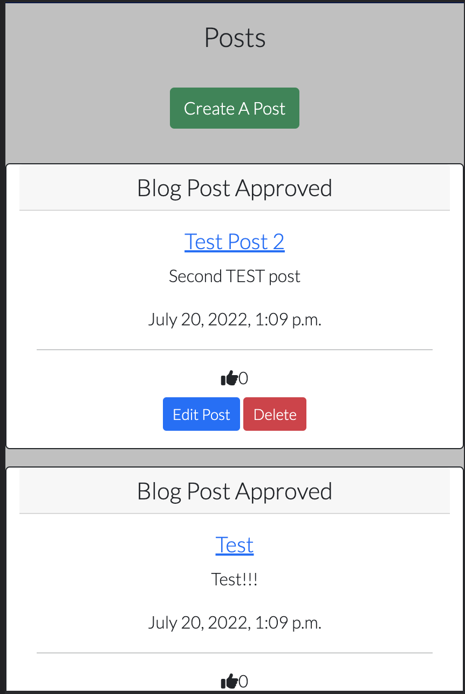

# Three Lions
Live deployment for the app here https://pp4-three-lions.herokuapp.com/

## About

The main objective of the Three Lions blog is to provide a user-friendly platform for people to discuss the England National Football team and their progress at the World Cup in 2022. The target end user is anyone and everyone who is interested in football, and who has a desire to follow and discuss England’s progress at the World Cup.

The blog provides functionality that allows the user to create a personal user account. This access thereby permits the user to interact with the forum platform and take part in discussions. End users are able to: 

	- Create posts.
	- Read posts.
	- Update posts - either their own, using the edit post option, or others’, by commenting and/or liking their posts.
	- Delete posts (only those which they have created themselves).

Additionally, users are given the option to edit and maintain their profile, which gives a brief introduction to any readers about the author whose profile they are viewing. The existing implementation of the user profile currently displays the user's name, location, and a brief biography.

When users decide to create a post, they are prompted to provide a unique title of their choosing, their post content, and an excerpt to contextualise their post.

Once the post has been created, it will published on the forum. Once the post is published, the user will be able to see them on the main post list page. From there the user will be able to edit and delete their posts.

Three Lions is a Django framework app. The user's post data is stored in a database with PostgreSql, and the app is hosted on Heroku. The Django administration site was utilised to provide admin control in order to monitor forum content, as well as super user control of CRUD operations - including the ability to delete other users’ posts and comments.

Below is the link to the live website:

## Project Planning

The main goal for this project was to create a simple, user-friendly application that provides an accessible and interactive platform for people to discuss the England National Football Team, and their progress at the 2022 World Cup. Features include the ability for users to:

1. Create a personal user account.
	- Permission based activity allows for controlled interactivity with the forum, cultivating a more positive and user-friendly environment.

2. Create their own posts under the name of their user account.
	- The ability to create their own posts gives users a platform to express their views, and promotes healthy discussion.

3. Manage their posted content, with the option to edit and delete their posts.
	- The ability to edit and delete content gives users control over what they post.

4. Have access to read other users’ posts, and the ability to like and comment on these posts.
	- The ability to read and interact with other users’ posts creates a platform for discussion and the building blocks for a community.

5. Admin access to all forum content, controlling what is posted and the ability to delete content after publication.
	- Admin access allows content to be monitored, promoting a positive and safe environment.

6. Edit their user profile.
	- The ability to edit and maintain a user profile allows the user to express their identity online and give additional context to posts.

The user stories for this project can be viewed [here](https://github.com/ConRdav/pp4-three-lions/projects/1)

## Project Management
I used GitHub's KanBan board to manage my workflow. [Three Lions Workflow](https://github.com/ConRdav/pp4-three-lions/projects/2)

I used KanBan because it offers a flexible and agile means of managing my workload. I find KanBan is especially effective for solo projects; it improved the efficiency of managing my workload through its accessible visualisation, and enhanced my productivity as a result.

The board allowed me to easily drag my stories through the business delivery lifecycle of: To Do -> In Progress -> Completed.

## Features

### Welcome to Three Lions
Upon opening the app, users are met with a landing page full of blog posts which even without an account they can view. 
The navbar for users without an account will have a sign up option allowing them to create their own account.

### Create An Account
Users have the ability to create a personal user account, thereby permitting them to create their own posts.

### Create A Blog Post
Once a user has their account set up, they are then given more options on the navbar including 'Create a post' and 'My posts'. 

When creating a post, the user is prompted to provide a unique title, a body of contents, and an excerpt to contextualise their post.

### View Your Own Posts
When a user clicks on 'My Posts', they will have a similar screen as the home page, yet filtered with only posts they have submitted, and it will show if the posts been approved by admin or if approval is pending.

### Delete Your Post
Users are able to manage their posted content. If the user wishes to remove and published posts, they can do so. In order to avoid accidental deletes, users will need to confirm they wish to delete their post before proceeding.

### Edit Your Post
Similarly to the 'Create Post' form, users can alter their previous posts and resubmit them for approval.

### Edit Your Profile
Users are able to edit and maintain their own user profile, which consists of their name, location and a brief biography.

**A detailed view of these features and their practical functionality is provided below in a sequence of images conducted during User Acceptance Testing.**

## Features left to implement
- Login via social media account, eg. facebook or google.
- Search bar to search for a particular blog or author.

## Testing

### Automated Testing
I used Django to run automated testing however, sqlite3 was used as a local database to achieve this testing.

* I used Django TestCase to test my forms.py, urls.py and views.py within test_forms.py, test_urls.py and test_views.py.

#### test_forms.py

#### test_urls.py

#### test_views.py

* I attempted to test models.py but didn't have a great understanding of what to test for so decided to continue with manual testing for the rest of my application in order to verify quality and usability from the user's perspective.

#### Django Coverage report

* Using Django Coverage I realised that I hadn't covered enough testing with Django TestCase so manual testing was the next step to cover more testing.

### Manual Testing
* I used a KanBan board to help plan my manual testing and the points I needed to hit. [Here](https://github.com/ConRdav/pp4-three-lions/projects/3)
* Post Model blog posts were ordered by creation date, the blog title is returned and that the like count is returned. .

* Comment model comments being ordered by creation date, and commenter name was returned along with the comment. 

* The paths from url.py that I didn't cover in my automated tested which were users_post, edit_post and delete_post. These links are working.

* If the user isn't logged in they can't create,edit or delete a post and the user can't comment or like a post. The user can view a post and signup or login.   

* Logged in users can create, edit and delete their posts. Can comment and like on posts aswell as the ability to sign out.
     

* Django Admin user can create, edit and delete posts from the Django admin panel, and can approve posts and comments from there too.
     

### Pep8 and Pylint Python Validators
* admin.py
 
* apps.py
 
* forms.py 
 
* models.py 
 
* urls.py
 
* views.py 
 
* test_forms.py

* test_urls.py 

* test_views.py 

### HTML Validation with Official W3C Validator
## base.html
* Offical W3C Validator picked up errors for using {{ }} and  syntax, this are used for Django functionality
## index.html
* Offical W3C Validator picked up errors for using {{ }} and  syntax, this are used for Django functionality
## create_post.html
* Offical W3C Validator picked up errors for using {{ }} and  syntax, this are used for Django functionality
## edit_posts.html
* Offical W3C Validator picked up errors for using {{ }} and  syntax, this are used for Django functionality
## post_detail.html
* Offical W3C Validator picked up errors for using {{ }} and  syntax, this are used for Django functionality
## user_posts.html
* Offical W3C Validator picked up errors for using {{ }} and  syntax, this are used for Django functionality
## django-all_auth's login.html edited for uniformity
* Offical W3C Validator picked up errors for using {{ }} and  syntax, this are used for Django functionality
## django-all_auth's logout.html edited for uniformity
* Offical W3C Validator picked up errors for using {{ }} and  syntax, this are used for Django functionality
## django-all_auth's signup.html edited for uniformity
* Offical W3C Validator picked up errors for using {{ }} and  syntax, this are used for Django functionality

### CSS Validation with Official W3C Validator

## LightHouse testing

## Responsive testing
This app has been tested on mobile and tablet devices and is responsive.

## Bugs
- During the final deployment, I encountered a ProgrammingError relating to data in my database model.
	- To resolve this issue I leveraged the following stackoverflow thread: https://stackoverflow.com/questions/55117984/relation-does-not-exist-django-postgres.
	
- When the user creates a post, a success message is supposed to be displayed. Initially, this was not working as expected, and instead no success message was being displayed and the application re-directed to the dashboard.
	- To resolve this issue, I refactored the code so that the user was not re-directed to the dashboard after the post was successfully created. Instead, the edit page was re-rendered with the success message visible, mirroring the implementation of the user comment action elsewhere in the application, which was successfully working. 
	
- When the user deletes a post, the 'My Posts' page should be reloaded with any remaining posts the user has published. However, I encountered an issue whereby even if the user did in fact have posts remaining post-deletion, the page was refreshed with no posts. 
	- To resolve this issue, I had to refactor the view, delete_post(). Initially, the page was re-rendered without passing in the post content to the render() method. In turn, I referred to the user_posts() view in order to initialise and pass in the logged_in_user_posts as a parameter, which would display any remaining active user posts.
	
- During development I encountered an issue with the user_posts() view form, whereby the get function was failing due to an error with input parameters not matching any data in the model.
	- I resolved this issue by clearing the cache, and therefore clearing any stagnant form data. 

- During the final deployment, I encountered a FileNotFoundError relating to the whitenoise module. 
	- I had imported the whitenoise module in order to try and resolve the bug reported below in the 'Existing Bugs' section, whereby I am unable to collect static files successfully.
	- In order to resolve the issue, I reverted my settings.py and wsgi.py files to their last working state - which is when I made my previous final deployment.

## Existing Bugs

- Unable to collect static files - css file not found
	- I have faced issues with managing my static files.
	- Following the final deployment, it was observed that this mismanagement of the static files resulted in my Django Admin page rendering without css in Heroku.
	- Locally, the Django admin renders as expected.
	- I have leveraged the following link: https://django.readthedocs.io/en/2.2.x/howto/static-files to no avail. Given more time, I would aim to resolve this issue in order to make the admin page more accessible.

## Deployment

Deployment procedure (using Heroku):

1. First, after logging in to the Heroku dashboard, navigate to ‘Create New App’.
2. Give your project a unique name and choose an appropriate region, before creating your app.
3. Navigate to the Resources tab. Using the Add Ons section, add ‘Heroku Postgres’ as the app’s database.
4. Create an env.py file in your root directory and import the os library within this file.
5. Within your env.py file, create environment variables for your DATABASE_URL and SECRET_KEY. They should appear as follows:

	__*os.environ[“DATABASE_URL”] = “___”__

	__*os.environ[“SECRET_KEY”] = “___”__

6. Assign a value to your DATABASE_URL and SECRET_KEY and within the Heroku settings tab, create corresponding Config Variables.
7. In your settings.py file, assign your Heroku app as a localhost in your ALLOWED_HOSTS variable, using the appropriate format:

	__app_name.herokuapp.com__

8. After updating all of the necessary environment and configuration variables in the settings.py and env.py files, create a new file at the top level directory called ‘Procfile’. 
9. Within Procfile, add the following code:

	__web: guincorn PROJECT_NAME.wsgi__

10. Using the Command Line interface: add, commit and push your files. 
11. Finally, navigate to the Deployment tab in Heroku and deploy your branch manually, observing the build logs for errors.
12. Heroku will build the app for you. If the build is successful, Heroku will provide a link to your live app.

### Django AdminUser
For this project the built in Django admin page is where the admin approves posts and comments so that they can be viewed on the post list.

## Used Technologies
* HTML
* CSS
* Python
* JavaScript

## Frameworks and Libraries used
* Django with;
    * gunicorn
    * psycopg2
    * postgresql
    * AllAuth
    * Crispy Forms
    * colorfield
* Bootstrap

## Credits
- Code Institutes I Think Therefore I Blog was a guide to help set up the enviroment and the final deployment details. (https://learn.codeinstitute.net/courses/course-v1:CodeInstitute+FST101+2021_T1/courseware/b31493372e764469823578613d11036b/fe4299adcd6743328183aab4e7ec5d13/)
- Codemy youtube page was used for the create_post method. (https://www.youtube.com/watch?v=CnaB4Nb0-R8)
- W3 Schools was used to help with bootstrap styling (https://www.w3schools.com/)
- Django docs helped with Django testing (https://docs.djangoproject.com/en/4.0/topics/testing/)

